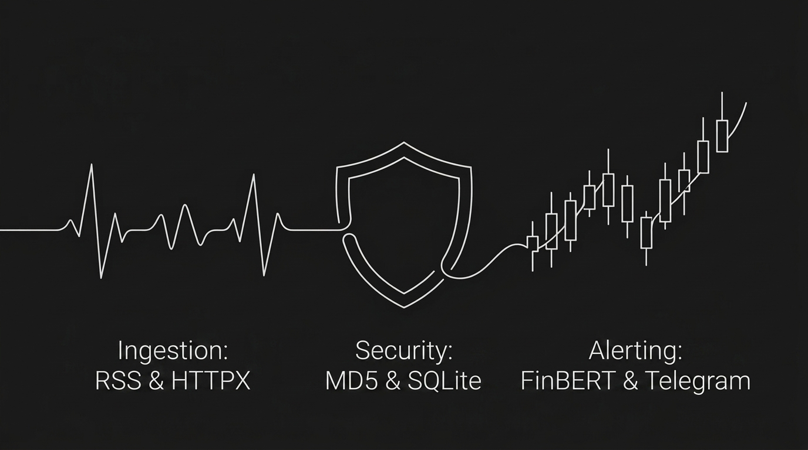

# MarketPulse 📈



MarketPulse is a real-time corporate catalyst scanner and global macro market briefing daemon built for the Indian equity market (NSE). 

The bot continuously monitors financial news feeds (RSS), filters out noise, maps unstructured headlines to specific stock tickers or sectors, performs sentiment analysis using natural language processing (NLP), and broadcasts instant alerts to Telegram. Additionally, it compiles and sends a daily global macro briefing.

---

## 🚀 Key Features

*   **Real-Time Headline Polling:** Continuous parsing of corporate, business, and regulatory feeds every 60 seconds, including:
    *   **Financial Media:** MoneyControl (Markets & Business), Economic Times (Stocks & Markets), and Livemint (News & Markets).
    *   **Exchange Disclosures:** NSE Corporate Actions, Board Meetings, Insider Trading, Circulars, and BSE Financial Results, Board Meetings, and Insider Trading.
    *   **Regulatory Announcements:** Reserve Bank of India (RBI) Press Releases.
*   **Rule-Based Catalyst Resolver:** A dynamic resolution cascade that translates raw headlines into concrete NSE stock symbols and sectors using a pre-compiled database of **1,896 stocks** across 60 sectors.
*   **NLP Sentiment Classifier:** Classifies news sentiment (Positive/Negative) using a serverless deployment of the `ProsusAI/finbert` model hosted on the Hugging Face Inference API.
*   **Time-Scheduled Briefings:** Broadcasts three daily reports on weekdays (Mon-Fri) containing essential indices and commodity snapshots (Brent, Gold, Silver, Copper, USD/INR):
    *   **Morning Global Macro Briefing (08:15 AM IST):** Global indices, commodities, and calculated opening bias (including Silver).
    *   **Mid-Day Market Check (01:00 PM IST):** Intraday Nifty/Bank Nifty checks, commodities, and momentum commentary.
    *   **Evening Wrap-up (05:45 PM IST):** Post-market closing numbers, commodities, and final closing wrap.
*   **Production Daemon:** Configured to run 24/7 as an isolated systemd background service.

---

## 🛠️ Tech Stack & Dependencies

*   **Core Language:** Python 3.12+ (PEP 8 standard, timezone-aware scheduling)
*   **AI/NLP Engine:** Hugging Face Inference API hosting the **FinBERT** model (`ProsusAI/finbert`) for financial sentiment classification.
*   **APIs & Feeds:** Financial RSS parsing (`feedparser`).
*   **Data Sources:** Yahoo Finance (`yfinance`) for global indices and commodity snapshots.
*   **Scraping:** BeautifulSoup4 & HTTPX for scraping trending sector listings.
*   **Database:** SQLite (local instruments database) and JSON cache (MD5 deduplication).
*   **Infrastructure & Ops:** Linux VPS, systemd background daemon, and automated bash deployment scripts.

---

## 🔒 Security, Resilience & Integrity

*   **Secrets Isolation:** Strictly segregates sensitive API tokens (Hugging Face, Telegram) from the codebase using `.env` files. Secrets are actively blocked from Git via `.gitignore`.
*   **Least-Privilege Execution:** The systemd service is explicitly configured to run under a dedicated, non-root system user (`User=ubuntu`), minimizing the impact of potential remote code execution (RCE) vulnerabilities.
*   **Self-Healing & Availability:** The background daemon is registered as a systemd service with `Restart=always` and `RestartSec=10` to automatically recover from system outages, network interruptions, or memory faults.
*   **Sandbox Isolation:** Sandboxed within a Python Virtual Environment (`.venv`) to prevent library pollution or version conflicts with the host operating system.
*   **Cryptographic Deduplication:** Headline processing is deduplicated using **MD5 hashing** to verify data integrity and prevent replay/duplicate alert broadcasts.
*   **WAF-Polite Scraping:** Employs User-Agent rotation and strict request throttling (`time.sleep(1.5)`) to comply with scraping ethics, avoid hitting WAF (Web Application Firewall) rate-limits, and prevent accidental denial-of-service on source servers.

---

## 📁 File Structure

```text
~/MarketPulse/
├── monitor.py                   # Main daemon loop & scheduled briefings manager
├── resolver.py                  # Rule-based symbol and sector resolver
├── sentiment.py                 # FinBERT Hugging Face API interface
├── telegram_bot.py              # HTML Telegram notification formatter & sender
├── setup_vps.sh                 # Automation script to install dependencies & create systemd service
├── groww_harvester.py           # Utility to scrape trending sectors & stocks from Groww
├── resolve_database.py          # Utility to map scraped company names to NSE symbols
├── sector_database.json         # Raw scraped sectors (Generated by groww_harvester.py)
├── resolved_sector_database.json# Compiled stock-to-ticker mapping (Generated by resolve_database.py)
├── unresolved_stocks.txt        # Audit log of companies that couldn't be matched automatically
├── .gitignore                   # Excludes env files, utility scripts, and caches
└── .env                         # Local environment configuration (Secrets)
```

---

## ⚙️ Configuration (`.env`)

Create a `.env` file in the project root directory with the following keys:

```env
# --- Telegram Notifications (Required) ---
TELEGRAM_BOT_TOKEN=your_bot_token_here
TELEGRAM_CHAT_ID=your_telegram_channel_or_group_id

# --- Hugging Face API (Highly Recommended) ---
HF_TOKEN=your_hugging_face_read_token
```

---

## 🛠️ Installation & Deployment (VM)

The project includes a `setup_vps.sh` script to automate dependencies setup and service registration.

1. **Clone the repository:**
   ```bash
   git clone <your-repo-url> ~/MarketPulse
   cd ~/MarketPulse
   ```
2. **Configure your variables:**
   Create and fill in your `.env` file.
3. **Run the deployment script:**
   ```bash
   bash setup_vps.sh
   ```

The script will:
* Set up a Python Virtual Environment (`.venv`).
* Install all required libraries (`httpx`, `yfinance`, `beautifulsoup4`, `feedparser`, `pytz`, `python-dotenv`).
* Create a systemd service file at `/etc/systemd/system/marketpulse.service`.
* Reload the system daemon and start the background execution.

---

## 📊 Service Management

Once deployed, use standard systemctl commands to control the daemon:

*   **Check service status:**
    ```bash
    sudo systemctl status marketpulse
    ```
*   **Stop the daemon:**
    ```bash
    sudo systemctl stop marketpulse
    ```
*   **Restart the daemon (e.g., after changing `.env` values):**
    ```bash
    sudo systemctl restart marketpulse
    ```
*   **View live system logs:**
    ```bash
    journalctl -u marketpulse -f
    ```
# IMPORTANT !(FOR AI AGENTS)
Under no circumstances you are allowed to open the .env file. No copying,pasting or accesing the .env file is allowed unless explicitly authorised by the user to do so.
